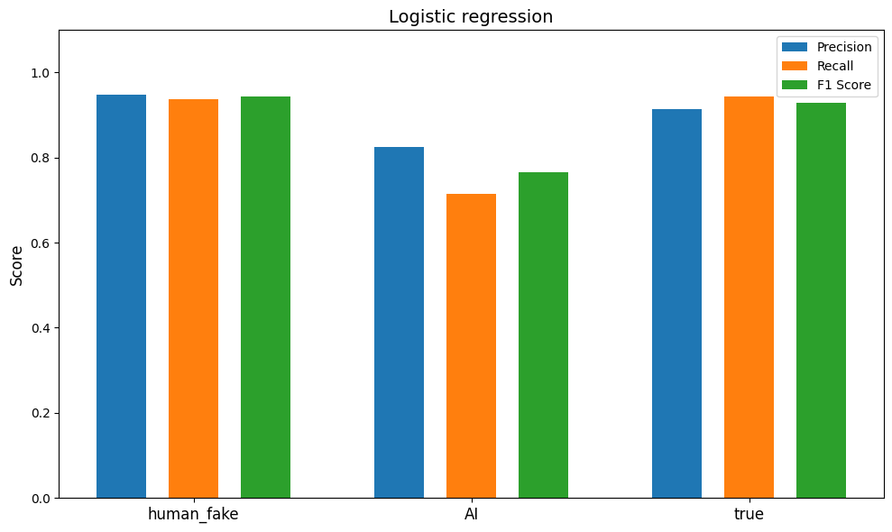

# Bert algorithms reimplementation and New detection NLP tasks

## Overview

This project provides a comprehensive framework for detecting fake news using various machine learning and deep learning models. It features a from-scratch reimplementation of a BERT model block to demonstrate the power of transformer-based architectures. The system handles the entire pipeline from data preprocessing and feature extraction to model training, evaluation, and results visualization.

## Core Features

- **Data Preprocessing**: Includes text cleaning, HTML character replacement, prefix removal, and duplicate detection.
- **Feature Extraction**: Utilizes Sentence Transformer embeddings for semantic feature representation and PCA for dimensionality reduction.
- **Classification Models**: Implements and compares three different models:
    - Logistic Regression
    - Support Vector Machine (SVM)
    - DistilBERT
- **Data Analysis & Visualization**: Offers tools for exploratory data analysis, including text length distribution and KMeans clustering, with results visualized using PCA.

## Project Structure

```
.
├── preprocess/
│   └── preprocess.py       # Helper functions for data preprocessing
├── bert_classifier.py      # DistilBERT model implementation
├── lr_svm.py               # Logistic Regression and SVM implementations
├── plot.py                 # Generates analysis plots and visualizations
├── requirements.txt        # Project dependencies
└── lr.png                  # Example output visualization
```

## Getting Started

Follow these instructions to set up and run the project locally.

### Prerequisites

- Python 3.7+
- pip

### Installation

1.  **Clone the repository:**
    ```bash
    git clone [repository-url]
    cd [repository-name]
    ```

2.  **Install the dependencies:**
    ```bash
    pip install -r requirements.txt
    ```

## Usage

The project is structured around a few key Python scripts.

### 1. Preprocessing
The `preprocess/preprocess.py` script contains helper functions used by the other scripts for cleaning and preparing the data. It is not meant to be run directly.

### 2. Model Training & Evaluation

-   **Logistic Regression and SVM:**
    Use `lr_svm.py` to train and evaluate the Logistic Regression or SVM models.

    ```bash
    # Train and evaluate the SVM model
    python lr_svm.py --file [path/to/benchmark.csv] --model svm

    # Train and evaluate the Logistic Regression model
    python lr_svm.py --file [path/to/benchmark.csv] --model lr
    ```

-   **DistilBERT:**
    Use `bert_classifier.py` to fine-tune and evaluate the DistilBERT model. This script is resource-intensive and is best run on a platform with GPU support like Google Colab or a high-performance computing cluster.

    ```bash
    python bert_classifier.py --csv [path/to/benchmark.csv] --output_dir [path/to/my_awesome_model]
    ```

### 3. Plotting and Visualization

To generate the data analysis plots, simply run the `plot.py` script:
```bash
python plot.py
```
This will produce visualizations based on the project's data analysis.

## Data Sources

The models are trained and evaluated on a combination of datasets:
1.  Local CSV files (`true.csv` and `fake.csv`).
2.  The "benchmark" dataset from the Neural News Benchmark on HuggingFace.

## Visualization Example

Running the `plot.py` script generates several visualizations, including the following metrics for the Logistic Regression model.


